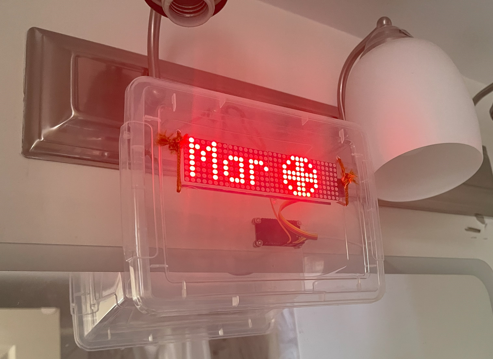

# max7219-esp8266-reminder-clock
This is very similar to [max7219-esp8266-synced-clock](https://github.com/phoenixphoebus/diy-electronics/tree/main/max7219-esp8266-synced-clock), except it shows month and year too, and reminds to shampoo and scrub.
Video:

## Case
I chose to buy a cheap plastic box from Dollarama(Canadian Dollar store) and fix the modules in it. 
Its easier this way rather than waiting for the public library to print a case.
