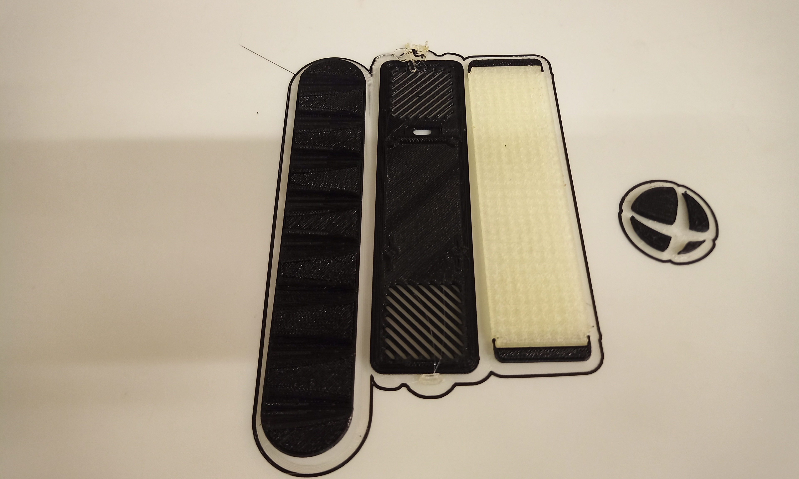
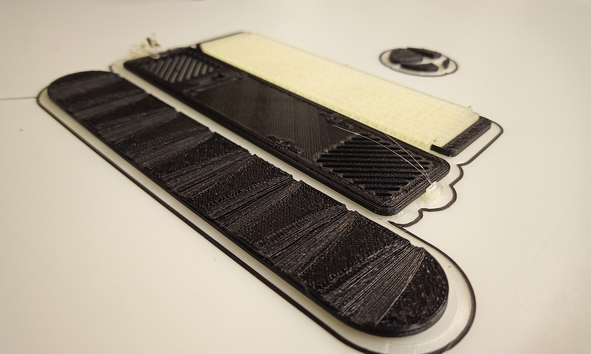

# max7219-esp8266-synced-clock
The aim was to build a clock that syncs with internet for time. Here's a video of the clock in action:

Extensions of this project are planned and would be to display conditional text based on time of day, location etc.

## Components
Microcontoller: esp8266
Display: max7219 FC16_HW (Hardware type FC16_HW is etched on the board under display leds. The display leds can be pulled out of headers to find it.)
Power source: Any 5V source

## Libraries
* MD_Parola - https://github.com/MajicDesigns/MD_Parola and https://github.com/MajicDesigns/MD_MAX72XX
* NTP_Client - https://github.com/arduino-libraries/NTPClient

## Code
The program has two arrays:
* sprite - contains animation object information
* msg - contains messages shown on led display

Program flow is pretty straight forward:
* setup() - connects to Wifi and initializes time client
* loop():
  * Iterate over the arrays and set message and sprite information accordingly
  * In case message to be displayed is equal to time placeholder constant, sync time with ntp and display it.
* convertToTwoDigitString() - This function pads zeros when hours and/or minutes return by ntp is less than 10.

## Wiring
There are numerous articles on the internet for connecting max7219 display with max7219 and have observed all of them to work in my experience. Please create an issue and I'll try to update this section as soon as possible.

## Case
I use a public library to 3d print cases and haven't been able to get a good one printed yet. The library uses Ultimaker 3 or Ultimaker S3.

I printed this case https://www.thingiverse.com/thing:4383145 and the grill doesn't match leds on my max7219.
Photo:

I think the case is for 1088AS display type and not FC16_HW. It could also have been due to an error in printing.
Another problem I had with the case was printing the grill. The printer failed to switch to PLA or something else happened but the print failed.
Photos:

I am trying to print this (https://www.thingiverse.com/thing:2885225) now and should have an update in two weeks. Yes, the library near my place is that busy. -_-

## FAQ
##### Why does max7219 show special characters?
The MD_PAROLA library uses pointers to access character array. The animation is done across multiple iterations of loop(). The displayAnimate() function returns true when animation has finished. Are you sure contents of the array persist across the iterations of loop function? 
##### Why does max7219 doesn't show anything?
Mostly, this is due to incorrect connections or faulty wires. Another reason is incorrect Wifi credentials. Error handling is not built into this code to keep it short and concise. I'll try to add some when I get some time. Until then, I apologize.
